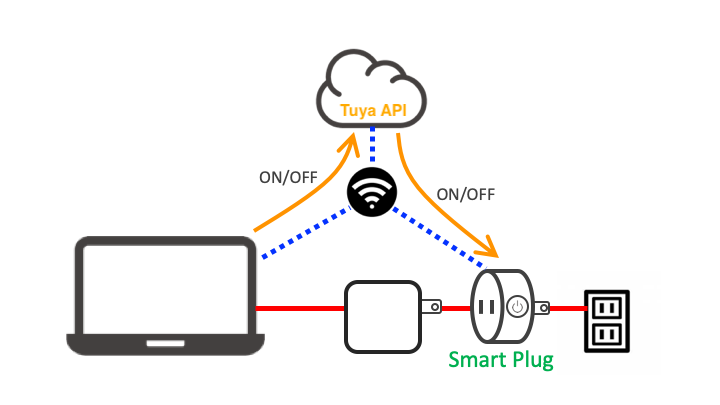

# Control Smart Plug with Tuya API

This repository explains to toggle smart plug (Smart Life product) with Tuya API.


## Installation

To install TypeScript and TuyAPI library, execute below.

```
./install.sh
```
> tuya-cli and following installation command is obsolete.
> ```
> npm i @tuyapi/cli -g
> ```

## Edit scripts

Edit following 3 part of statements.

```
  const context = new TuyaContext({
    baseUrl: 'https://openapi.tuyaus.com',
    accessKey: 'XXXXXXXXXXXXXXXXXXXX',
    secretKey: 'YYYYYYYYYYYYYYYYYYYYYYYYYYYYYYYY',
    });
    
  const main = async () => {
    // Define the device ID
    const device_id = "ZZZZZZZZZZZZZZZZZZZZ";
```

## Compile scripts

To compile TypeScript, execute like below.
```
~/node_modules/.bin/tsc get_command.ts
~/node_modules/.bin/tsc plug_on.ts
~/node_modules/.bin/tsc plug_off.ts
```
Or you can also use ~/node_modules/.bin/ts-node *.ts for direct execution of TypeScript.

## Get available commands

To check available commands for your device, execute below.
```
node get_command.js
```
The following result example tells us that there are 2 commands:
- switch (Boolean)
- countdown_1 (Integer)
```
Execution result: {
  "result": {
    "category": "cz",
    "functions": [
      {
        "code": "switch",
        "desc": "switch",
        "name": "switch",
        "type": "Boolean",
        "values": "{}"
      },
      {
        "code": "countdown_1",
        "desc": "countdown 1",
        "name": "countdown 1",
        "type": "Integer",
        "values": "{\"unit\":\"s\",\"min\":0,\"max\":86400,\"scale\":0,\"step\":1}"
      }
    ]
  },
  "success": true,
  "t": xxxxxxxxxxxxx
}
```

## Execution
Execute compiled JavaScript by tsc.
```
node plug_on.js
node plug_off.js
```
If you want to send other command, modify body/commands.
```
  const commands = await context.request({
    path: `/v1.0/iot-03/devices/${device_id}/commands`,
    method: 'POST',
    body: {
      "commands":[{"code":"switch","value":true}]
    }
  });
```

## Blog
The below blog article explains how to use Smart Tuya App and create cloud project, too.

https://take6shin-tech-diary.com/tuyapi-smartplug/
